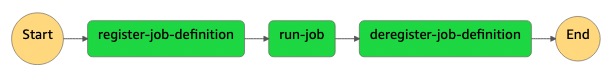

# dynamic-batch-job-definition

This project dynamically creates a batch job definition, executes the job, and then de-registers the job definition.



## Quickstart

1. Deploy the CDK stacks to your account to deploy the step function and associated lambdas.

    ```shell
    cdk deploy
    ```

2. Prepare any docker image and deploy it to an ECR repository. If you don't have one handy, we will use the [`hello-world` docker image](https://hub.docker.com/_/hello-world) as an example and deploy it to an ECR repository named `personal`.

    First, we set up the AWS environment variables for authentication.

    ```shell
    unset AWS_DEFAULT_PROFILE
    unset AWS_DEFAULT_REGION

    export AWS_PROFILE=...
    export AWS_REGION=us-east-1
    ```

    Then, we create the `personal` ECR repository ...

    ```shell
    aws ecr create-repository --repository-name personal
    ```

    ... and login to it via the docker CLI.

    ```shell
    AWS_ACCOUNT_ID="$(aws sts get-caller-identity --query 'Account' --output text)"
    ECR_REPOSITORY="$AWS_ACCOUNT_ID.dkr.ecr.$AWS_REGION.amazonaws.com/personal"

    aws ecr get-login-password --region us-east-1 | docker login --username AWS --password-stdin "$ECR_REPOSITORY"
    ```

    Last, we pull the `hello-world` docker image from DockerHub and push to `personal` ECR repository.

    ```shell
    export DOCKER_DEFAULT_PLATFORM=linux/amd64
    docker pull hello-world
    docker tag hello-world "${ECR_REPOSITORY}:hello-world"
    docker push "${ECR_REPOSITORY}:hello-world"
    echo "Docker Image: ${ECR_REPOSITORY}:hello-world"
    ```

3. Run the deployed the step function with the following JSON input:

    Replace `image` in the JSON below with the path to your ECR image.

    ```json
    {
        "name": "hello-world",
        "image": "TKTKTKTK.dkr.ecr.us-east-1.amazonaws.com/personal:hello-world",
        "vCPUs": 1,
        "memoryMiB": 256
    }
    ```
